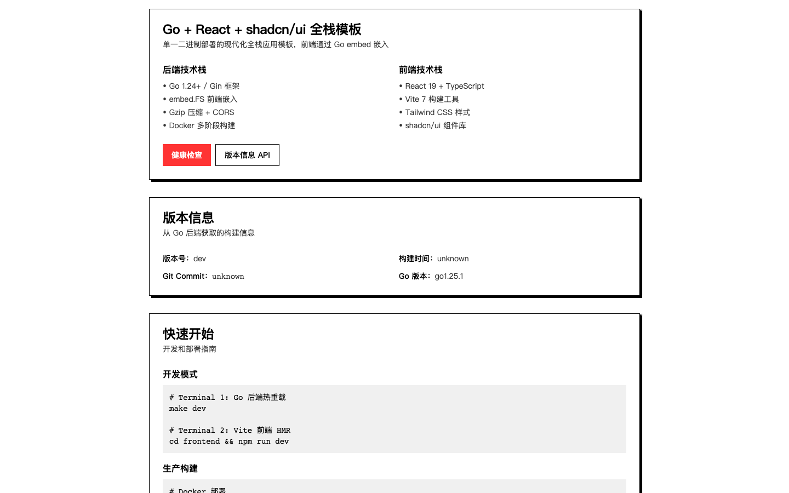

# go-shadcn-demo

> 现代化的 Go + React + shadcn/ui 全栈应用模板：单一二进制部署、GHCR 自动发布、极致开发体验

[](https://github.com/zuijiaosy/go-shadcn-demo/actions/workflows/ci.yml)
[](https://github.com/zuijiaosy/go-shadcn-demo/actions/workflows/docker.yml)
[](https://go.dev/)
[](LICENSE)

## 界面预览



## ✨ 特性

- **单一二进制部署** — 前端通过 `go:embed` 打包进二进制，部署只需一个文件
- **GHCR 自动发布** — GitHub Actions 自动构建多架构镜像（amd64/arm64）并推送到 ghcr.io
- **极小镜像体积** — Alpine 多阶段构建，最终镜像约 40-60MB，非 root 用户运行
- **开发热重载** — Air 热重载 Go 代码 + Vite HMR 热更新前端
- **shadcn/ui 开箱即用** — 已集成 Button、Card 组件与 Tailwind CSS 4
- **版本信息注入** — CI 自动注入 Git 版本、提交哈希、构建时间
- **生产就绪** — 健康检查、优雅关闭、CORS、Gzip 压缩、安全响应头、单元测试、CI

## 📦 技术栈

| 层 | 技术 |
|---|---|
| 后端 | Go 1.24 · Gin · `go:embed` |
| 前端 | React 19 · TypeScript 5.9 · Vite 7 · Tailwind CSS 4 · shadcn/ui |
| 工程化 | Air 热重载 · GitHub Actions CI · GHCR 多架构镜像 · Make |

## 🚀 快速开始

### 前置要求

- Go 1.24+
- Node.js 20+

### 开发模式

```bash
git clone https://github.com/zuijiaosy/go-shadcn-demo.git
cd go-shadcn-demo

# Terminal 1: 启动 Go API（Air 热重载，首次自动安装）
make dev

# Terminal 2: 启动前端（Vite HMR）
cd frontend && npm install && npm run dev
```

- 前端开发地址：http://localhost:5173（`/api` 自动代理到 8080）
- Go API 地址：http://localhost:8080

### 模拟生产（embed 模式）

```bash
make setup   # 构建前端并嵌入 Go
make run     # 启动完整应用，访问 http://localhost:8080
```

### 本地构建二进制

```bash
make build   # 输出 ./app（前端已嵌入）
./app
```

## 🐳 Docker 部署

镜像由 GitHub Actions 自动构建并发布到 GHCR，**无需本地打包**：

```bash
# 直接运行
docker run -d -p 8080:8080 ghcr.io/zuijiaosy/go-shadcn-demo:latest

# 或使用 docker-compose
make docker-up      # 等价于 docker-compose pull && up -d
make docker-logs    # 查看日志
make docker-down    # 停止
```

**镜像标签规则**（见 `.github/workflows/docker.yml`）：

| 触发条件 | 生成标签 |
|---|---|
| 推送到 `main` | `latest` |
| 推送标签 `v1.2.3` | `1.2.3`、`1.2` |

发布新版本只需打标签：

```bash
git tag v1.0.0 && git push origin v1.0.0
```

## 📖 项目结构

```
├── cmd/server/            # 应用入口（优雅关闭、版本日志）
├── internal/
│   ├── api/               # HTTP API 层（路由、中间件、静态文件、测试）
│   │   └── frontend/dist/ # 前端构建产物嵌入点（自动生成）
│   └── buildinfo/         # ldflags 注入的版本信息
├── frontend/              # React + shadcn/ui 前端
│   └── src/components/ui/ # shadcn/ui 组件
├── scripts/setup-dev.sh   # 构建前端并嵌入 Go
├── .github/workflows/     # CI + GHCR 镜像发布
├── Dockerfile             # 多阶段构建（Node → Go → Alpine）
└── Makefile               # 常用命令入口（make help）
```

## 🔧 常用命令

```bash
make help    # 查看全部命令
make dev     # Go 热重载开发
make setup   # 前端构建并嵌入
make test    # 运行 Go 测试
make fmt     # gofmt 格式化
make vet     # go vet 静态检查
make clean   # 清理构建产物
```

## 📡 API 端点

| 方法 | 路径 | 说明 |
|---|---|---|
| GET | `/api/health` | 健康检查，返回 `{"status":"ok"}` |
| GET | `/api/version` | 版本信息（版本号、commit、构建时间、Go 版本） |

### 添加新端点

编辑 `internal/api/server.go` 的 `setupAPIRoutes`：

```go
func (s *Server) setupAPIRoutes() {
    api := s.router.Group("/api")
    {
        api.GET("/health", s.healthCheck)
        api.GET("/version", s.getVersion)
        api.GET("/users", s.getUsers) // 新端点
    }
}
```

### 添加 shadcn/ui 组件

```bash
cd frontend
npx shadcn@latest add [component-name]
```

## ⚙️ 配置

通过环境变量配置（参考 [.env.example](.env.example)）：

| 变量 | 默认值 | 说明 |
|---|---|---|
| `SERVER_ADDR` | `:8080` | 服务器监听地址 |
| `GIN_MODE` | `debug` | Gin 运行模式（生产用 `release`） |
| `CORS_ORIGINS` | 空 | 额外允许的 CORS 来源（逗号分隔） |

## ❓ 常见问题

**Q: 克隆后 `go build` 会失败吗？**
不会。`internal/api/frontend/dist/.gitkeep` 占位文件保证未构建前端时也能编译，只是访问页面前需要先 `make setup`。

**Q: 修改了前端，embed 模式看不到更新？**
embed 是编译期嵌入，需重新执行 `make setup`。日常开发请用前后端分离模式（Vite HMR）。

**Q: 如何使用自己的仓库？**
全局替换模块路径 `github.com/zuijiaosy/go-shadcn-demo` 为你的仓库路径（涉及 `go.mod`、Go 源码 import、`Dockerfile`、`docker-compose.yaml`）。

## 🤝 贡献

欢迎 Issue 和 PR！请阅读 [贡献指南](CONTRIBUTING.md)。

## 📄 许可证

[MIT](LICENSE) © 2026 zuijiaosy
